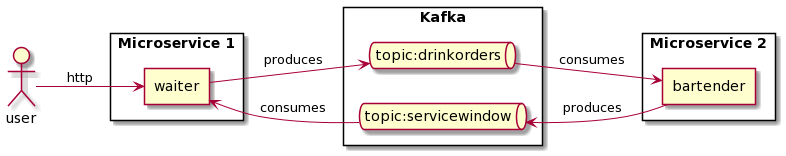

# Simple Kafka example

This implementation produces orders and prepares drinks.

Run the following commands:

```bash
foo@host:~$ docker stop $(docker ps -a -q)
foo@host:~$ docker rm $(docker ps -a -q)
foo@host:~$ docker-compose build
foo@host:~$ docker-compose up
foo@host:~$ curl -X POST -H "Content-Type: application/json" http://localhost:8080/order -d '{"name":"coconut"}'
foo@host:~$ curl -X GET -H "Accept: application/json" http://localhost:8080/collect
```


